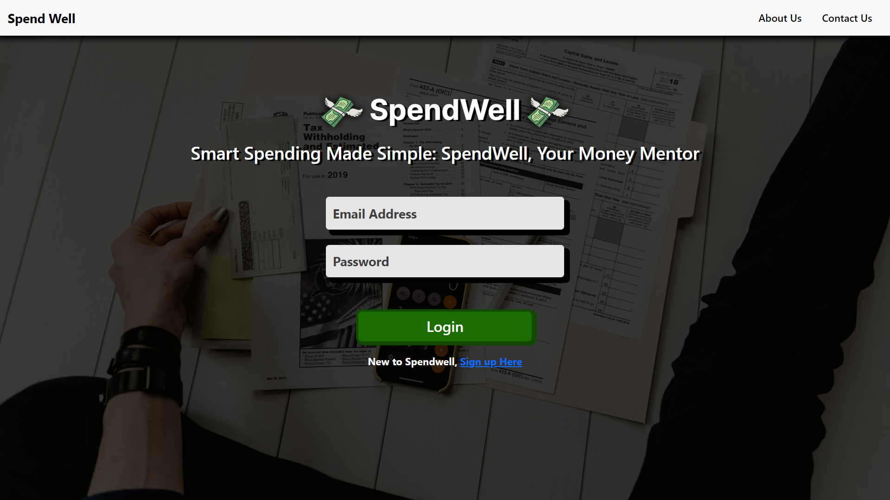

# SpendWell - Budget Management System

SpendWell is an online platform dedicated to proficient budget management for both individuals and organizations. It serves as a comprehensive tool for financial information management, allowing users to monitor and control their expenses and income effectively. Users are provided with secure login credentials, enabling access to SpendWell's intuitive interface. SpendWell, a Budget Management System, is to provide individuals and organizations with a powerful tool for effectively managing their finances. At its core, SpendWell aims to streamline the process of budgeting, tracking expenses, and monitoring income.

## Technologies Used

- HTML
- CSS
- Javascript
- Bootstrap
- React
- Node
- Express
- Mongo
- MERN

## Getting Started

This section explains how to set up your project locally for development.

### Prerequisites

Make sure you have the following installed on your local machine:

- **Node.js**: [Download and install](https://nodejs.org/)
- **npm** or **yarn**: Comes bundled with Node.js.

### Installation

To install the project, follow these steps:

1. **Clone the repository:**

   ```bash
   git clone https://github.com/debugger-snjy/SpendWell-Frontend
   ```

2. **Installing the Node Packages:**

   ```bash
   npm install
   ```

3. **Running the Application:**

   ```bash
   npm start
   ```

4. **Running the Backend Project:**
   Also, As we have a different [Backend Project](https://github.com/debugger-snjy/SpendWell-Backend), then we will download, install, and run the Backend Project like we have run this project

## Screenshots

Login Page:


